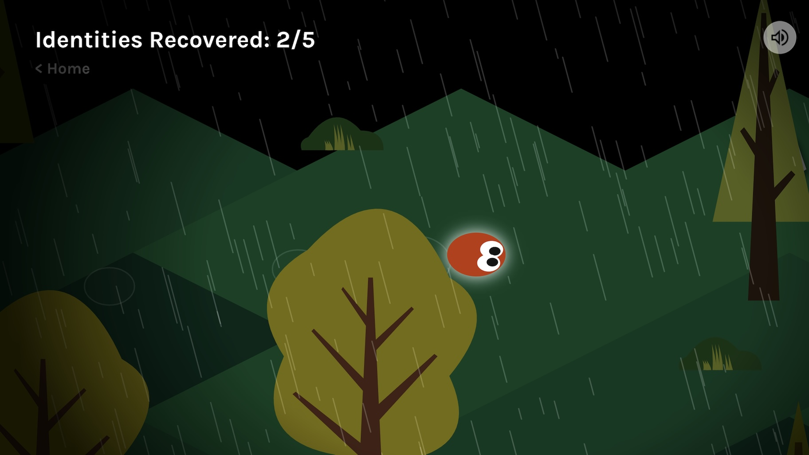
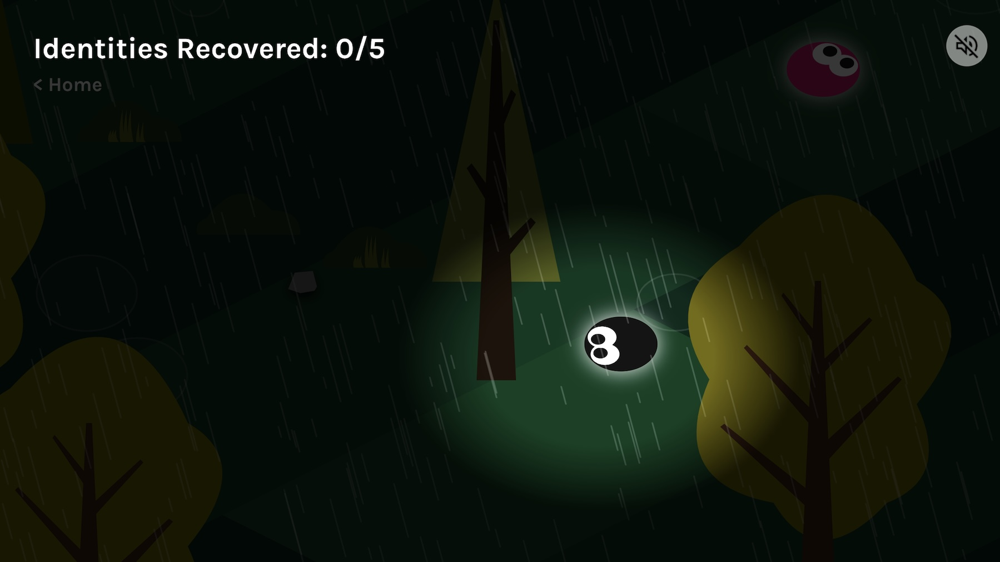

# xshi0520_9103_tut6

# Part 1
The screenshots are from a p5.js game project. The imaging technique I would like to identify is the *shadows for 2D objects*. In this game, the shadows of the cursor and objects create a sense of suspense. When using JavaScript to create artwork, art styles with abstract and geometric styles can be easier. But for more figurative art, the light and shadow effect appears to be important. It will be useful for our project's interactive objects if moved to create more realistic lighting effects and an immersive feeling for users.  

# Part 2
There are functions for shadows and gradients in the **CanvasRenderingContext2D** from the Canvas API. It can create 2D shadows and maintain a high frame rate. For example, in Monet's artworks, the effects of light and shadow are very prominent. This technique can be useful when a shadow or illumination effect is needed.

[CanvasRenderingContext2D: shadowBlur property](https://developer.mozilla.org/en-US/docs/Web/API/CanvasRenderingContext2D/shadowBlur)
